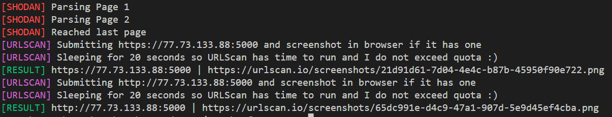

# InfraHunter

Actively hunt for attacker infrastructure by filtering Shodan results with URLScan data.

## Requirements

- Shodan API Key
- URLScan API Key
- `python3 -m pip install -r requirements.txt`

## Usage Example

`python3 .\hunter.py -q "http.html:'titan stealer'" -s {Shodan API Key} -u {URLScan API Key}`

## What do I do?

1. Search Shodan with the query provided by `-q, --query`
2. For each IP, submit it to URLScan
    - If it has multiple open ports, all ports will be submitted
    - Submits *http* and *https* URLs
3. Same process for all domains
4. Check URLScan for an image from each submission
    - For all results that have an image that is not blank, open the URLScan page for that result in the browser (unless `--no-browser` is provided)

## API Rate Limiting

The tool is harcoded to sleep 20 seconds between URLScan submissions to be nice. By default it uses public scans, this can be changed with `--scan-type`.